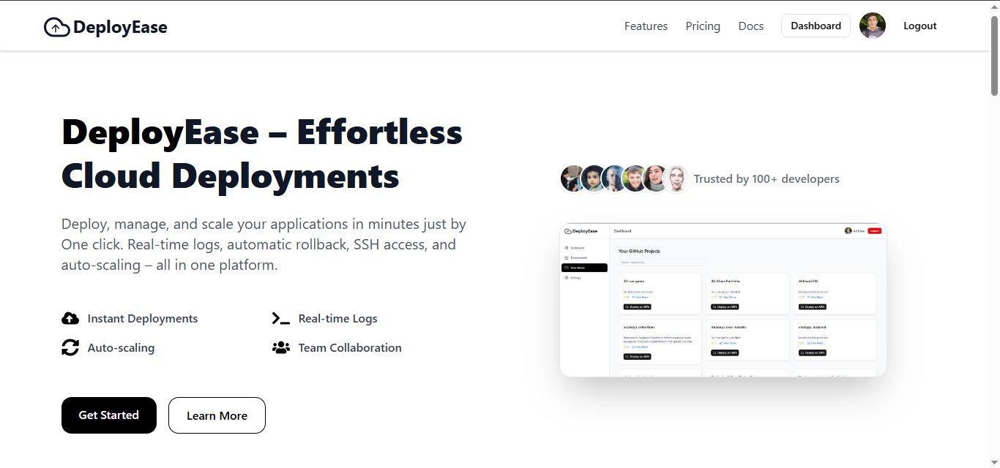

### **Project Overview: DeployEase**

**Project Name:** DeployEase

**Author:** Ali Khan

**Affiliation:** BSc Computer Software Engineering, UET Mardan

**Contact:** [alikhandevs@gmail.com](mailto:alikhandevs@gmail.com)

**Description:**
DeployEase is a web-based platform that automates deployment workflows for cloud applications on AWS. It simplifies complex DevOps tasks like provisioning EC2 instances, configuring security groups, installing runtime dependencies, managing environment variables, and configuring Nginx. The platform targets developers, students, and small teams by providing a beginner-friendly, one-click deployment dashboard while retaining transparency and control over the underlying infrastructure.

**Current Features:**

* **GitHub Authentication:** OAuth-based login for secure user access.
* **Dashboard Management:** View and manage deployments with quick actions such as live logs, deletion, and in-browser SSH access.
* **One-Click Deployment:** Directly deploy repositories from GitHub to EC2.
* **Automated EC2 Provisioning:** Provision new instances or deploy to existing ones with runtime dependencies and environment setup.
* **Dynamic Nginx Configuration:** Host multiple applications on a single instance under unique slugs/subpaths.
* **Live SSH Terminal:** Browser-based terminal for debugging and file management.
* **Automated Load Balancer:** Balance HTTP(S) traffic across multiple instances via AWS ALB.
* **Auto-Scaling & Auto-Replication:** Automatically scale instances based on resource usage.
* **Increase Volume of Runing Instances:** Select the instance and click to increase the volume just provide the value how much you want to increase and it will handle every thing.
* **Public URL Generation:** Access applications via generated URLs without manual DNS or server configuration.
* **MCP Server for AI Agents:** Model Context Protocol server that enables AI agents to deploy repositories, scale applications, and manage infrastructure through natural language commands.

**Planned Enhancements:**
DeployEase is evolving to include features that make it suitable for production-like environments:

* **Health Checks & Monitoring:** Detect unhealthy instances and provide visual metrics on the dashboard.
* **HTTPS/SSL Integration:** Automatic TLS certificate issuance via Let’s Encrypt.
* **CI/CD Integration:** Deploy on commit or merge events using GitHub Actions or GitLab CI.
* **Versioning & Rollback:** Maintain deployment versions and revert to previous stable releases.
* **Docker Support:** Deploy containerized applications for microservices.
* **Cost Estimation & Resource Management:** Provide real-time usage and budget estimation.
* **Database Provisioning (Optional):** Connect to existing or managed databases (MongoDB, PostgreSQL).

**New Feature Proposals (from GitHub Todo Tasks):**

1. **Attach Volumes to Existing Instances:** Provide users the option to attach additional storage volumes to EC2 instances.
2. **Choose Deployment Target for Static Apps:** Let users deploy static sites either on S3 (serverless) or EC2.
3. **Deploy-On-Commit Options:** Enable automatic deployment triggered by Git repository commits.
4. **Local File Uploads:** Allow users to upload local files and deploy applications even if no GitHub repository is linked.

**Impact and Use Cases:**
DeployEase significantly lowers the barrier for cloud deployment, making it accessible for learners, small teams, and freelance developers. It accelerates prototyping and MVP development, supports testing real applications in the cloud, and provides hands-on experience with AWS infrastructure without requiring deep DevOps expertise.

**Technology Stack:**

* **Frontend:** React/Next.js, Tailwind CSS
* **Backend:** Node.js, Express, AWS SDK v3
* **Database:** MongoDB/PostgreSQL
* **Live SSH Terminal:** node-pty + WebSocket
* **Provisioning Scripts:** Bash + systemd on EC2
* **MCP Server:** Model Context Protocol SDK for AI agent integration

**MCP Server:**

DeployEase includes an MCP (Model Context Protocol) server that allows AI agents to interact with the platform. The MCP server is located in the `mcp-server/` directory and provides tools for:

* Deploying GitHub repositories to AWS EC2
* Scaling applications with auto-scaling groups
* Increasing instance storage volumes
* Listing deployments and instances
* Checking deployment status

See `mcp-server/README.md` for setup and usage instructions.
